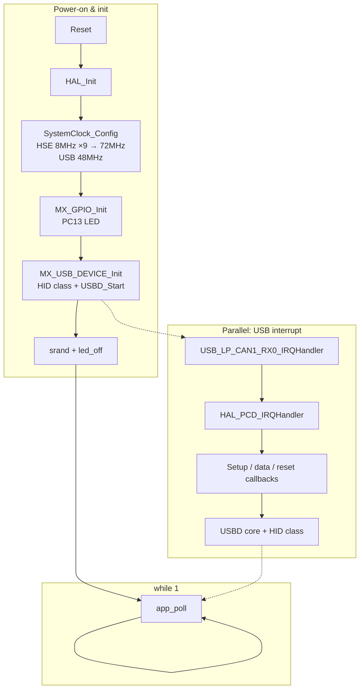
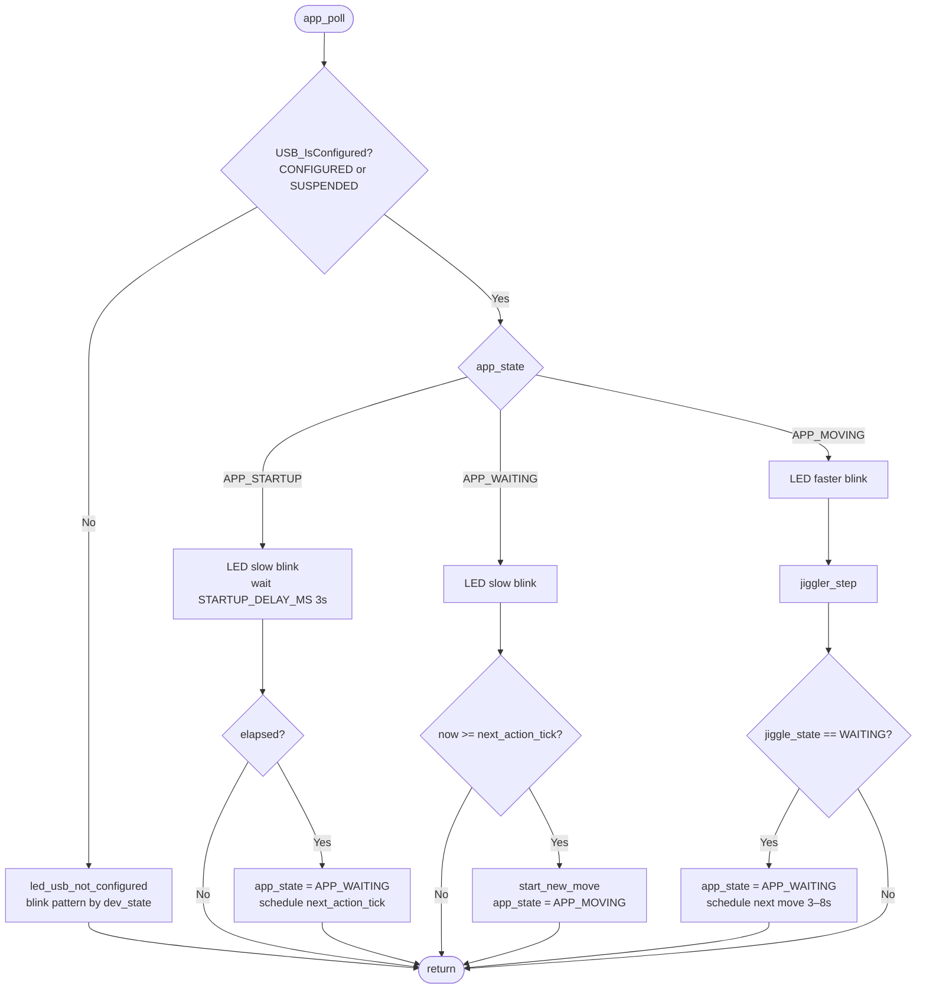
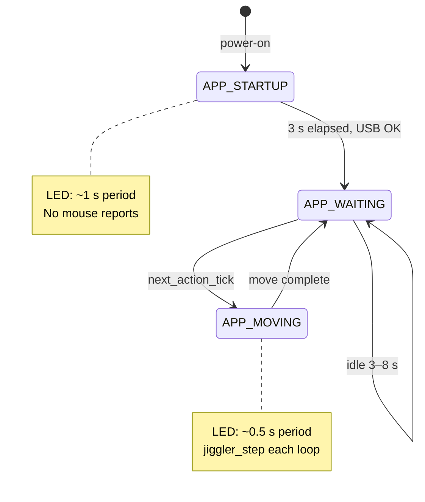
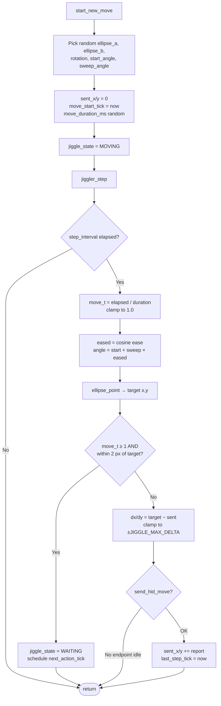
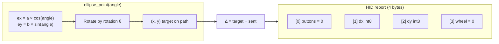
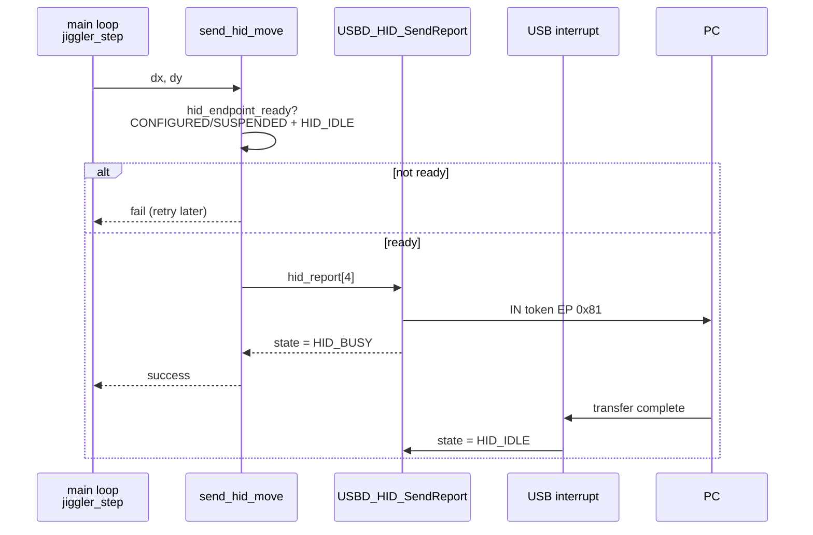
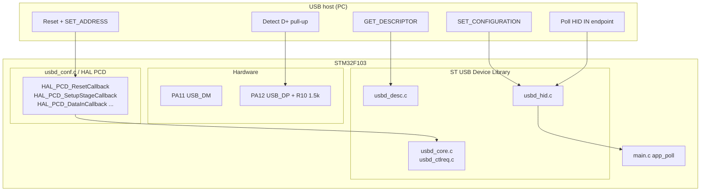
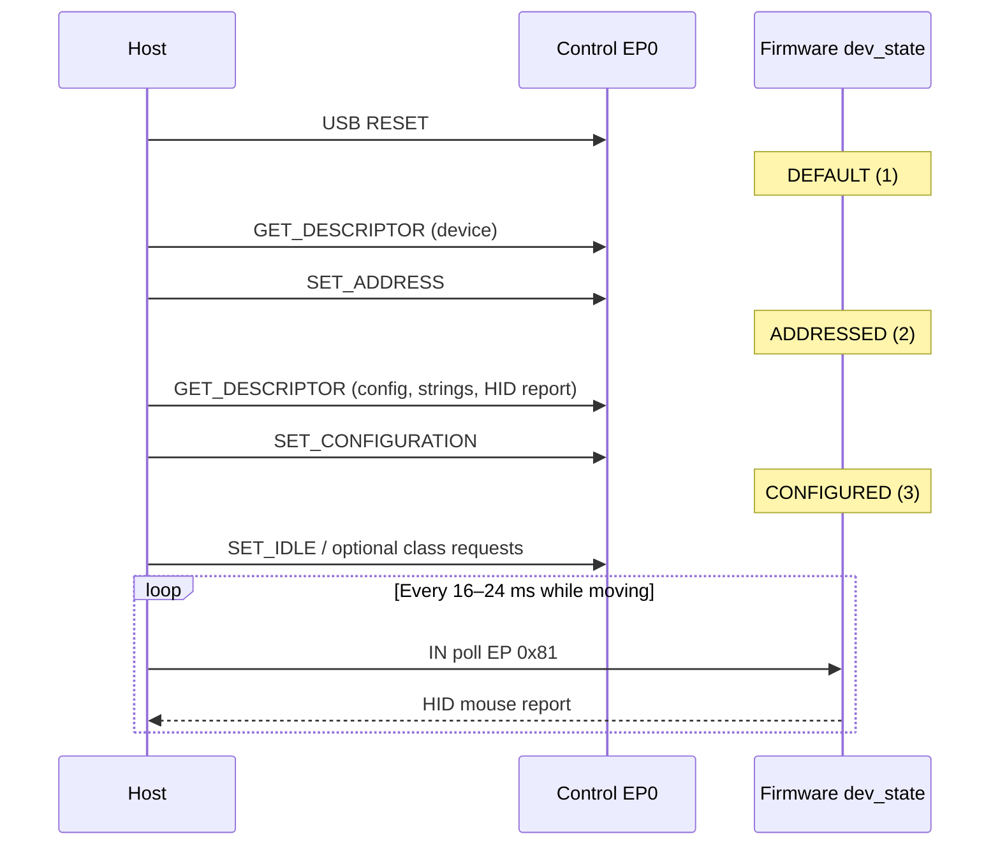

# mausJiggler

USB HID mouse jiggler firmware for the **STM32F103C8** (“Blue Pill”). The board enumerates as a standard USB mouse and periodically moves the cursor along smooth, random elliptical paths so the host PC does not go idle.

Built with **STM32CubeMX** / **STM32CubeIDE**, using the ST USB Device Library (HID mouse class).

---

## Features

- Presents as a **USB HID mouse** (no drivers on Windows / Linux / macOS)
- **Smooth curved movement** along random elliptical arcs
- **Random timing** between moves (3–8 s) and random path geometry
- **Onboard LED** status: USB link health and activity
- Tunable movement speed, smoothness, and idle intervals via constants in `Src/main.c`

---

## Hardware

| Item | Detail |
|------|--------|
| MCU | STM32F103C8T6 (64 KB flash, 20 KB RAM) |
| Board | STM32 “Blue Pill” (or compatible) |
| Crystal | **8 MHz HSE** (marking `8.000`) — default firmware config |
| USB | Micro-USB on **PA11** (D−) / **PA12** (D+) |
| LED | **PC13** (active-low on most Blue Pill clones) |
| Debug | SWD on PA13/PA14 (optional; disconnect for normal use) |

### Wiring notes

- **R10** (1.5 kΩ on D+) is required for USB enumeration — standard on Blue Pill.
- Use a **data-capable** USB cable (not charge-only).
- For daily use: power from **micro-USB only**; unplug **ST-Link USB** and SWD so the device port is free.

### Windows identity

| Field | Value |
|-------|--------|
| VID | `1A2C` |
| PID | `0003` |
| Manufacturer | `Generic` |
| Product | `USB Optical Mouse` |

Device Manager typically shows **USB Optical Mouse** or **HID-compliant mouse** under Mice and pointing devices — not STM32/STMicro.

```powershell
Get-PnpDevice | Where-Object { $_.InstanceId -like '*VID_1A2C&PID_0003*' }
```

**What admins can still see:** VID/PID in hardware IDs, HID mouse class, and a hex serial from the chip UID. They will **not** see STMicro strings or ST VID `0483` unless CubeMX regenerates `usbd_desc.c` and overwrites these values.

---

## Quick start

1. Open the project in **STM32CubeIDE** (`mouse_jiggler.ioc`).
2. Build the **Debug** configuration.
3. Flash with ST-Link (SWD).
4. Disconnect ST-Link; plug **only** the Blue Pill micro-USB into the PC.
5. Wait ~3 s startup, then ~3–8 s until the first cursor movement.

Verify on Windows:

```powershell
Get-PnpDevice | Where-Object { $_.InstanceId -like '*PID_0003*' -and $_.InstanceId -like '*VID_1A2C*' }
```

---

## LED behaviour

| Pattern | Meaning |
|---------|---------|
| **Fast continuous blink** | No USB setup packets from host (cable, port, or jack issue) |
| **N blinks, pause, repeat** | `N` = USB `dev_state` (1 = DEFAULT, 2 = ADDRESSED, 4 = SUSPENDED) |
| **Slow blink (~1 s)** | USB configured; startup or waiting between moves |
| **Faster blink (~0.5 s)** | Actively sending mouse movement |
| **Very fast strobe (~50 ms)** | `Error_Handler` — usually HSE crystal failure |

---

## Tuning movement

Edit the constants at the top of `Src/main.c`:

```c
#define JIGGLE_WAIT_MIN_MS      3000   // min idle time between moves
#define JIGGLE_WAIT_RANGE_MS    5000   // + random → 3–8 s total
#define JIGGLE_STEP_MIN_MS      16     // HID report interval (min)
#define JIGGLE_STEP_RANGE_MS      8    // → 16–24 ms between reports
#define JIGGLE_MOVE_MIN_MS       900   // duration of one arc (min)
#define JIGGLE_MOVE_RANGE_MS     600    // → 0.9–1.5 s per move
#define JIGGLE_MAX_DELTA           2    // max pixels per HID report
```

| Goal | Suggestion |
|------|------------|
| Slower arcs | Increase `JIGGLE_MOVE_MIN_MS` / `JIGGLE_MOVE_RANGE_MS` |
| Smoother motion | Lower `JIGGLE_MAX_DELTA` to `1`, shorten step interval |
| Less frequent jiggles | Increase `JIGGLE_WAIT_*` |
| Larger/smaller moves | Adjust `randf()` ranges in `start_new_move()` |

### Clock options

```c
#define USE_HSI_CLOCK  0          // 0 = HSE (required for correct USB)
#define BOARD_HSE_MHZ  8          // 8 or 12 to match crystal marking
```

USB on STM32F103 needs **72 MHz SYSCLK** and **48 MHz USB clock** from HSE. HSI cannot provide a spec-compliant USB clock.

---

## Project structure

```
mausJiggler/
├── Src/
│   ├── main.c              # App state machine, jiggler math, LED, clock
│   ├── usb_device.c        # USB init, USB_IsConfigured(), helpers
│   ├── usbd_conf.c         # Low-level USB (PCD), IRQ callbacks, PMA
│   ├── usbd_desc.c         # USB descriptors (VID/PID, strings)
│   ├── stm32f1xx_it.c      # USB_LP_CAN1_RX0_IRQHandler
│   └── ...
├── Inc/
│   ├── usb_device.h
│   ├── usbd_conf.h
│   └── ...
├── Middlewares/ST/STM32_USB_Device_Library/
│   ├── Core/               # USB device core, control requests
│   └── Class/HID/          # HID mouse class, report descriptor
├── Startup/
├── mouse_jiggler.ioc       # CubeMX configuration
└── STM32F103C8TX_FLASH.ld  # Linker (heap 0x400, stack 0x800)
```

### Key source files (application logic)

| File | Role |
|------|------|
| `main.c` | `app_poll()`, jiggler, LED, `SystemClock_Config()` |
| `usb_device.c` | `MX_USB_DEVICE_Init()`, connection helpers |
| `usbd_conf.c` | `HAL_PCD_*` callbacks, endpoint PMA, static HID heap |
| `usbd_desc.c` | Device/config/string descriptors |
| `usbd_hid.c` | HID class, report descriptor, `USBD_HID_SendReport()` |

---

## Code flow overview

High-level picture from power-on to cursor movement:



---

## Main loop (`app_poll`)

Every iteration of `main()` calls `app_poll()`. USB work runs in interrupts; the main thread only drives the jiggler and LED.



### Application state machine



---

## Jiggler movement

Each move is a **time-based** chase along a random elliptical arc (not fixed waypoint jumps). Progress `move_t` goes from 0 → 1 over `move_duration_ms` (~0.9–1.5 s).



### Ellipse geometry



Movement is **relative**: each report sends small `dx`/`dy` deltas; the host accumulates them. `sent_x`/`sent_y` track how far we have sent along the current arc (not absolute screen position).

---

## HID send path



`send_hid_move()` only fires when the previous report finished (`HID_IDLE`). That prevents overrunning the single interrupt IN endpoint.

---

## USB stack flow

CubeMX generates a standard **USB FS device + HID mouse** stack.



### Enumeration sequence



### Custom USB fixes in this project

Several changes were made on top of the CubeMX defaults for reliable Blue Pill enumeration:

| Area | Change |
|------|--------|
| `usbd_ctlreq.c` | Set `CONFIGURED` only **after** `USBD_SetClassConfig()` succeeds |
| `usbd_hid.c` | Allow `USBD_HID_SendReport()` in **SUSPENDED** state |
| `usbd_conf.c` | Ignore suspend until configured; reset HID alloc on bus reset |
| `usbd_desc.c` | Fallback serial string if chip UID is zero |
| `main.c` | HSE required (no silent HSI fallback); verify `HSERDY` |

---

## Building

### Requirements

- [STM32CubeIDE](https://www.st.com/en/development-tools/stm32cubeide.html) 1.13+ (or compatible GCC ARM toolchain)
- ST-Link V2 (or clone) for programming
- Optional: `STM32CubeProgrammer` for standalone flashing

### Steps

1. **File → Import → Existing Projects into Workspace** → select repo root.
2. Select project **mouse_jiggler**.
3. **Project → Build Project** (Debug configuration).
4. **Run → Debug** (or flash `Debug/mouse_jiggler.hex`).

Linker settings (`STM32F103C8TX_FLASH.ld`):

- Flash: 64 KB
- RAM: 20 KB
- Heap: `0x400`, Stack: `0x800`

---

## Troubleshooting

| Symptom | Things to check |
|---------|------------------|
| No device in Device Manager | Data cable; USB jack solder; ST-Link disconnected; try rear USB 2.0 port |
| LED fast blink forever | Host not seeing USB data lines |
| LED 2 blinks, no enumeration | HSE/crystal; wrong `BOARD_HSE_MHZ`; charge-only cable |
| LED very fast strobe | HSE failed — check 8 MHz crystal and load caps |
| Mouse moved once then stopped | Fixed in current firmware (SUSPENDED + time-based path) — reflash latest |
| Cursor too fast/choppy | Adjust `JIGGLE_*` constants in `main.c` |

### Debug variables (SWD)

| Symbol | Expected when working |
|--------|------------------------|
| `hUsbDeviceFS.dev_state` | `3` (CONFIGURED) or `4` (SUSPENDED) |
| `g_usb_setup_count` | Increases on plug-in |
| `g_usb_config_ok_count` | ≥ 1 after enumeration |

---

## License

STM32 HAL and USB middleware: **ST SLA0044** (see ST distribution files).  
Application code in `Src/main.c` and project-specific changes: use per your repository license.

---

## Acknowledgements

- [STM32CubeMX](https://www.st.com/stm32cubemx) / STM32CubeF1 HAL
- ST USB Device Library (HID mouse template)
